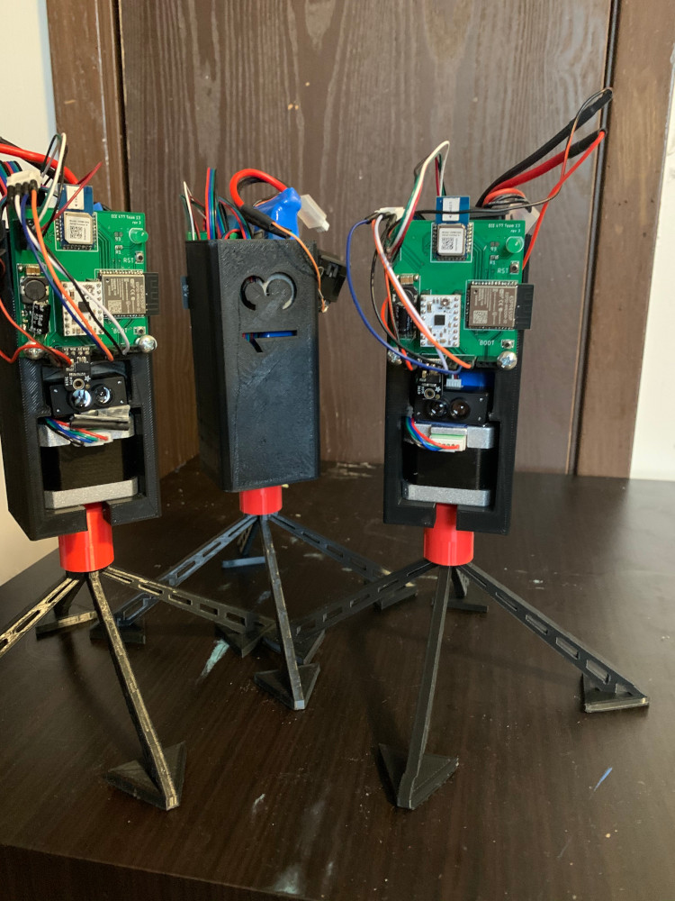
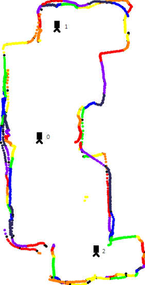
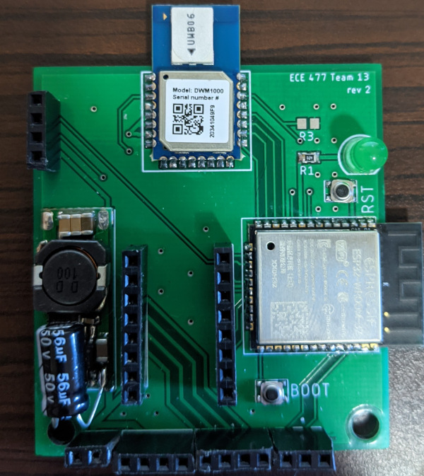

# Purdue ECE 477 - Senior Design - Team 13
## Dynamic Sensor Array
This project aims to create a cost-effective solution to mapping interior spaces of unknown configuration using n amount of nodes
that can be laid out to cover as much of interior space as needed. The mapping is for a top-down 2D representation of a room and can be used
in various applications like real estate and industrial applications.

The original aim was to have modularity of sensors on board that could map various environment variables like temperature as the mapping was being done.

## Table of Contents
* [Structure](#structure)
    * [Nodes](#nodes)
    * [Server](#server)
    * [SLAM](#slam)
* [Hardware](#hardware)
    * [Components](#components)
    * [PCB](#pcb)
    * [Packaging](#packaging)
* [Programming](#programming)
* [Frontend](#frontend)
* [Dependencies](#dependencies)

## Structure
The project is made up of the following general components:
1. Node(s)
2. Server
3. SLAM

### Nodes

**Figure 1** Nodes completed for the project.

These are individually programmable devices that can operate alone or in conjuction with other nodes. The packaging holds the battery and hardware along with the distance measuring sensors.

### Server
This can be anything that can run python and connect to Wi-Fi. While developing this project, a laptop was used to connect and manage deployed nodes and process incoming data using SLAM. In terms of using Wi-Fi, either a local network or a hotspot from the laptop should suffice as the only requirement is having the nodes and server be on the same network. The server can also utilize the frontend environment built with Flask to avoid using the terminal.

### SLAM
The bulk of the software in this repository aside from ESP code is the SLAM processing code. This takes takes the distance measurement data from the nodes and builds and outputs a 2D layout of the mapped space. 

**Figure 2** Sample map output from SLAM using data collected by three nodes.

## Hardware
### Components
| Component | Purpose |
| --- | --- |
| ESP32-WROOM-32 | Microcontroller - Connection to server |
| DWM1000 | Distance measurements between nodes |
| DRV8834 | Stepper motor driver |
| MPM3601 | 3V buck converter |
| UBEC 5V | 5V buck converter |

### PCB

**Figure 3** A revision 2 board. Note: revision 3 has same layout, but different GPIO pins are used.
### Packaging

## Programming
### ESP-IDF
Programming requires the use of a USB-Serial cable and can be found on [Adafruit](https://www.adafruit.com/product/70) as an example.

0. Setup ESP-IDF on your machine. Instructions can be found [here](https://docs.espressif.com/projects/esp-idf/en/latest/esp32/get-started/).
1. Plug in the cable into your machine and wire the `orange`, `yellow`, and `black` pins to the board in that order to the programming header.
2. Power on the node and put it in flash mode by holding `BOOT` and pressing `RST`. Let go of both.
3. Run `idf.py flash` (optionally add `-p PORT` to specify which port you're using).
4. Wait until completion and press `RST`.

## Frontend - Optional
### Flask

## Dependencies
### For SLAM
scipy, numpy, pygame